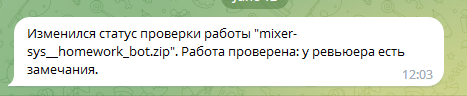
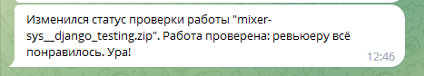

# Python telegram bot

  
# Info
### Telegram-bot, который обращается к API сервису Практикум.Домашка и узнавает статус домашней работы: взята ли ваша домашка в ревью, проверена ли она, а если проверена — то принял её ревьюер или вернул на доработку.

# Requirements
### Для запуска необходи файл '.env'.
### .env (Пример)
##### PRACTICUM_TOKEN = '<practicum_token>'
##### TELEGRAM_TOKEN = '<telegram_token>'
##### TELEGRAM_CHAT_ID = <telegram_char_id>

# Bot work
## Бот
### 1. Раз в 10 минут опрашивает API сервис Практикум.Домашка и проверяет статус отправленной на ревью домашней работы;

### 2. При обновлении статуса анализирует ответ API и отправляет соответствующее уведомление в Telegram;

### 3. Логирует свою работу и сообщает о важных проблемах сообщением в Telegram.

  
# Messages example  in Telegram:

# Description
### Функция <u>check_tokens()</u> проверяет доступность переменных окружения, которые необходимы для работы программы.

### Функция <u>get_api_answer()</u> делает запрос к единственному эндпоинту API-сервиса. В качестве параметра в функцию передается временная метка. В случае успешного запроса возвращает ответ API, приведя его из формата JSON к типам данных Python.

### Функция <u>check_response()</u> проверяет ответ API на соответствие документации API сервиса Практикум.Домашка. В качестве параметра функция получает ответ API, приведенный к типам данных Python. В случае успеха возвращает словарь с последней домашкой.

### Функция <u>parse_status()</u> извлекает из информации о конкретной домашней работе статус этой работы. В качестве параметра функция получает только один элемент из списка домашних работ. В случае успеха, функция возвращает подготовленную для отправки в Telegram строку, содержащую один из вердиктов словаря HOMEWORK_VERDICTS.

### Функция <u>send_message()</u> отправляет сообщение в Telegram чат, определяемый переменной окружения TELEGRAM_CHAT_ID. Принимает на вход два параметра: экземпляр класса Bot и строку с текстом сообщения.